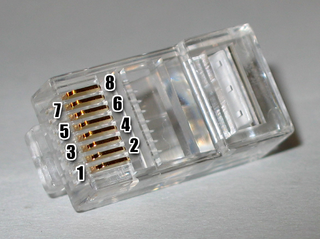

# Ethernet

## Twisted pair

### Cable shielding

| ISO/IEC11801 Name | Cable Shielding Type | Twisted Pair Shielding Type | Picture                                          |
| ----------------- | -------------------- | --------------------------- | ------------------------------------------------ |
| U/UTP             | none                 | none                        |    |
| F/UTP             | foil                 | none                        |    |
| S/UTP             | braiding             | none                        |    |
| SF/UTP            | braiding & foil      | none                        |  |
| U/FTP             | none                 | foil                        |    |
| F/FTP             | foil                 | foil                        |    |
| S/FTP             | braiding             | foil                        |    |
| SF/FTP            | braiding & foil      | foil                        |  |

### Cable categories

| Name   | Bandwidth | Applications                              |
| ------ | --------- | ----------------------------------------- |
| Cat 1  | 0.4 MHz   | Telephone and modem lines                 |
| Cat 2  | 4 MHz     | Older terminal systems, e.g. [[IBM 3270]] |
| Cat 3  | 16 Mhz    | 10BASE-T / 100BASE-T4                     |
| Cat 4  | 20 MHz    | 16 Mbit/s Token Ring                      |
| Cat 5  | 100 MHz   | 100BASE-TX / 1000BASE-T                   |
| Cat 5e | 100 MHz   | 1000BASE-T / 2.5GBASE-T                   |
| Cat 6  | 250 MHz   | 5GBASE-T / 10GBASE-T                      |
| Cat 6a | 500 MHz   | 5GBASE-T / 10GBASE-T                      |
| Cat 7  | 600 MHz   | 5GBASE-T / 10GBASE-T                      |
| Cat 7a | 1000 MHz  | 5GBASE-T / 10GBASE-T                      |
| Cat 8  | 2000 Mhz  | 25GBASE-T / 40GBASE-T                     |

### RJ45 termination

| Pin | T568A color| T568B color|
| ----| ----- | ----- |
| 1   |  white/green stripe |  white/orange stripe |
| 2   |  green solid |  orange solid |
| 2   |  white/orange stripe |  white/green stripe |
| 2   |  blue solid |  blue solid |
| 2   |  white/blue stripe |  white/blue stripe |
| 2   |  orange solid |  green solid |
| 2   |  white/brown stripe |  white/brown stripe |
| 2   |  brown solid |  brown solid |