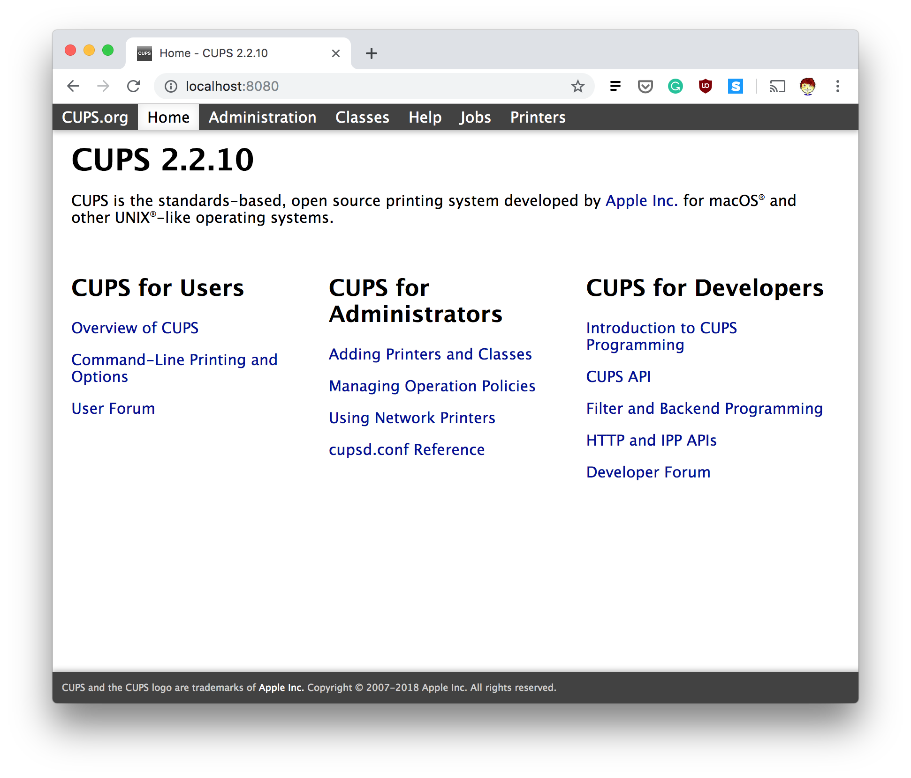
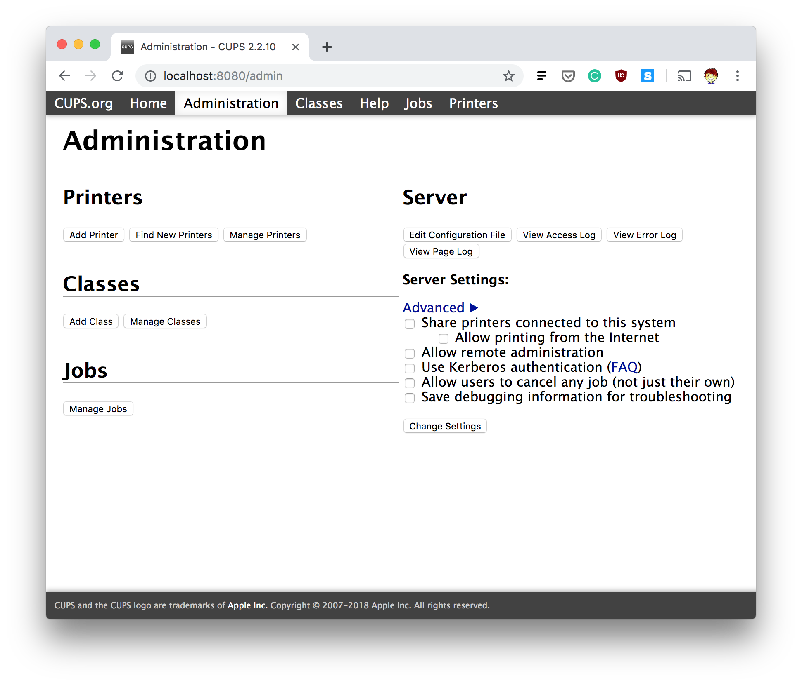
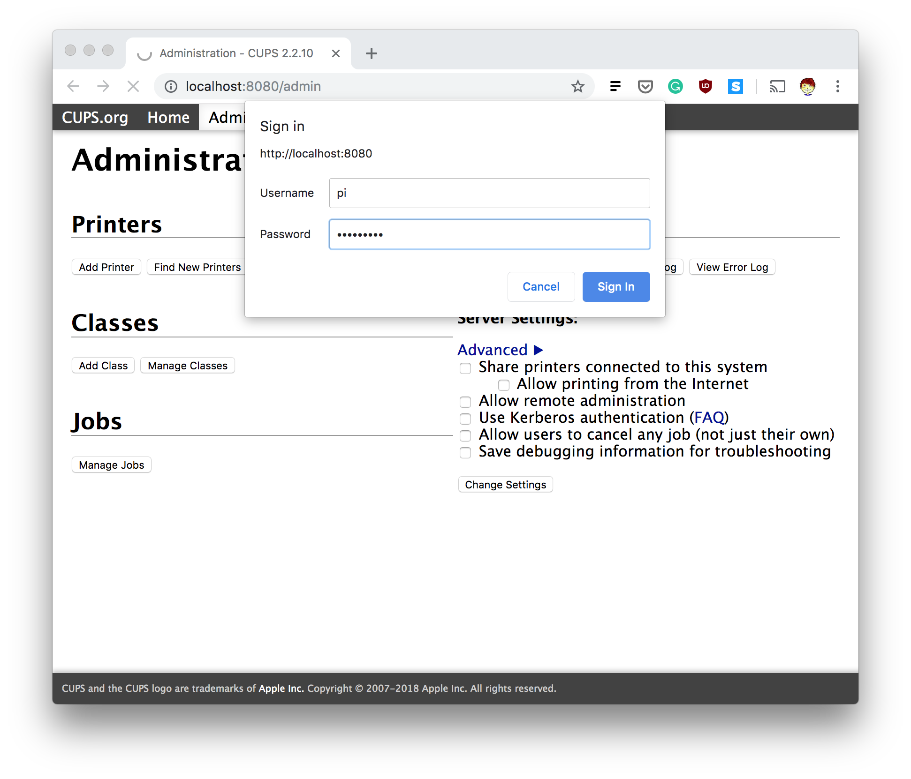
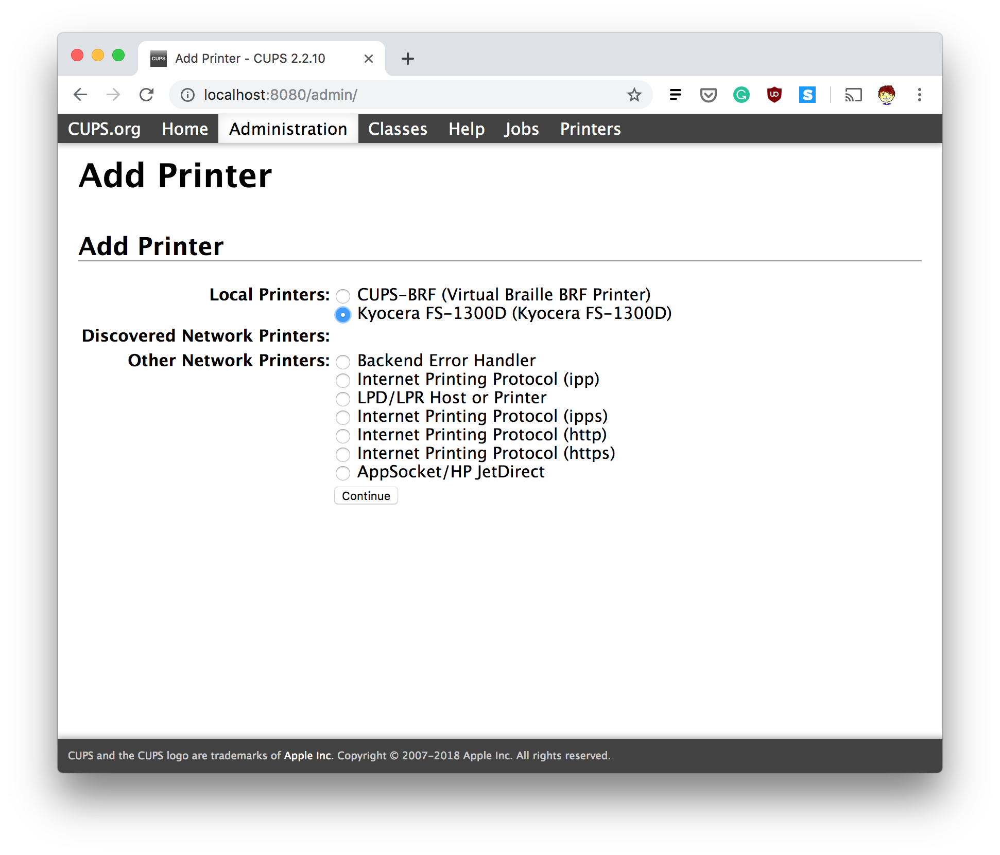
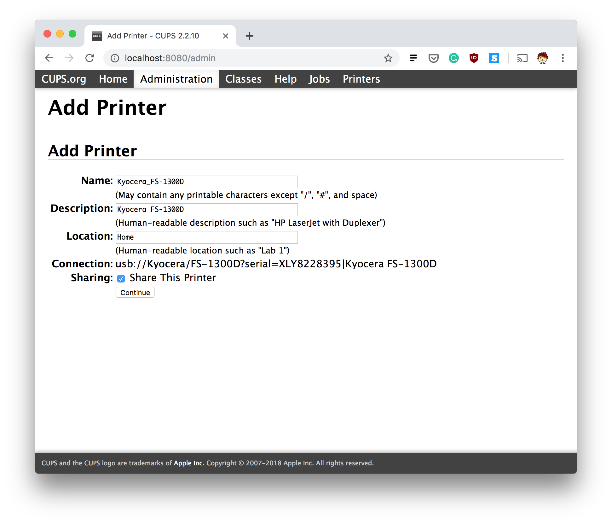
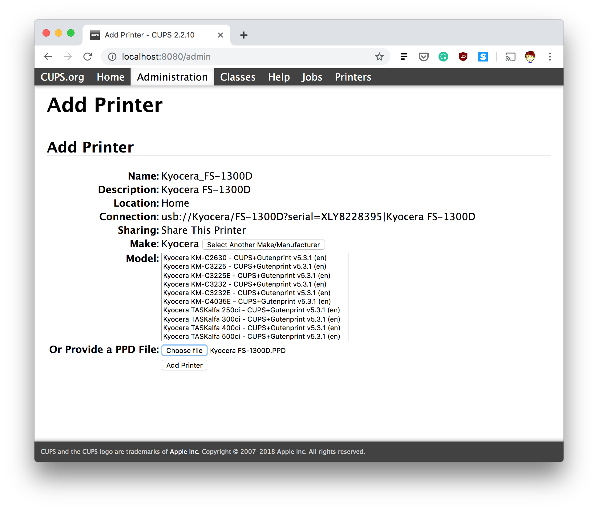
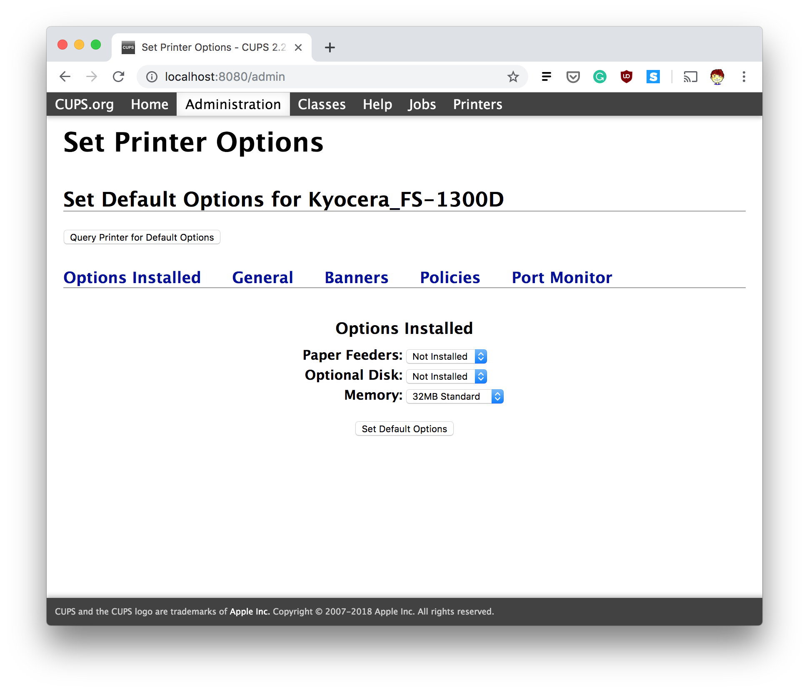

# Google Cloud Print Server on a Raspberry Pi

## Install CUPS 

Install via package manager
```
sudo apt-get install cups
```

Add pi to the lpadmin group
```
sudo usermod -a -G lpadmin pi
```

## Add printer via web interface

Create SSH tunnel to the pi
```
ssh pi@raspberrypi.local -L8080:localhost:631 -N
```

Open `localhost:8080` in a web browser


Navigate to the `Administration` tab and click `Add Printer`.


CUPS will ask you to authenticate with a username and password. This is your system username and password, e.g. username "pi" and password "raspberry" by default.


Select your printer then click `Continue`


Fill in some key details and hit continue. Be sure to check `Share This Printer`.


Now select your model from the list of drivers available. If thereis no driver installed then you can provide a PPD file. Then click `Add Printer`.


Finally, set your default printing options.


On the Administration tab tick the box before `Share printers connected to this system` and click `Change Settings`.


## Install Google Cloud Print Connector

Install via package manager 
```
apt get install google-cloud-print-connector
```

Generate `gcp-cups-connector.config.json` by running the command below and following the instructions

```
gcp-connector-util init
```

Test if cloud print working
```
gcp-cups-connector -config-filename [path to gcp-cups-connector.config.json]
```

Create a systemd service and save as `cloud-print-connector.service`
```
[Unit]
Description=Google Cloud Print Connector
Documentation="https://github.com/google/cloud-print-connector"
After=cups.service avahi-daemon.service network-online.target
Wants=cups.service avahi-daemon.service network-online.target

[Service]
ExecStart=/usr/bin/gcp-cups-connector -config-filename /home/pi/gcp-cups-connector.config.json
Restart=on-failure
User=root

[Install]
WantedBy=multi-user.target
```

Install the previously created service
```
sudo install -o root -m 0664 cloud-print-connector.service /etc/systemd/system
```

Enable Google Cloud Print CUPS Connector service
```
sudo systemctl enable cloud-print-connector.service
```

Start Google Cloud Print CUPS Connector service
```
sudo systemctl start cloud-print-connector.service
```

## Useful links

* https://www.cups.org/doc/admin.html
* https://samhobbs.co.uk/2014/07/raspberry-pi-print-scanner-server
* https://github.com/google/cloud-print-connector